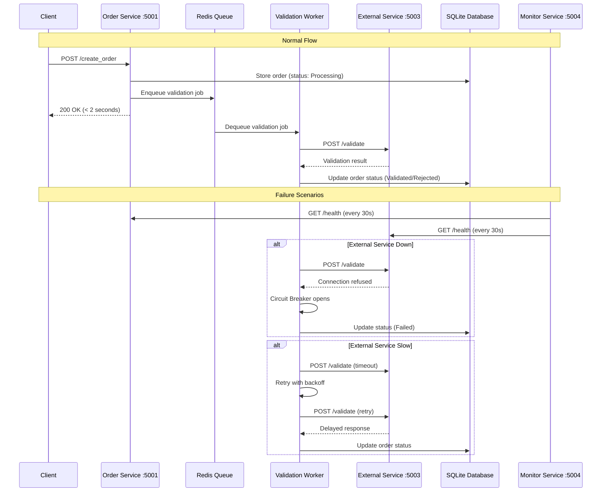

# MediSupply Resilience Experiment

This project implements a microservices architecture experiment to validate resilience patterns when dealing with external service failures using asynchronous communication.

## System Architecture



## Architecture Overview

The system consists of 6 microservices:
- **API Gateway** (Port 8080): Single entry point for external requests, proxies to internal services
- **Order Service** (Port 5001): Receives order creation requests and queues them
- **Validation Service** (Port 5002): Processes orders asynchronously and validates with external service
- **External Service** (Port 5003): Simulates third-party validation service with controllable failure modes
- **Monitor Service** (Port 5004): Monitors health of all services and provides system status
- **Redis**: Message queue and caching layer

## Prerequisites

- Docker and Docker Compose
- Python 3.11+ (for running test scripts locally)

## Quick Start

### 1. Start the System

```bash
# Clone and navigate to project directory
git clone <repository-url>
cd MISW4202-g14-MediSupply

# Create and activate virtual environment
python -m venv venv
source venv/bin/activate  # On Windows: venv\Scripts\activate

# Install Python dependencies
pip install -r requirements.txt

# Start all services
docker compose up --build

# Check all services are running
docker compose ps
```

### 2. Verify System Health

```bash
# Check individual service health
curl http://localhost:8080/health  # API Gateway
curl http://localhost:5001/health  # Order Service
curl http://localhost:5002/health  # Validation Service  
curl http://localhost:5003/health  # External Service
curl http://localhost:5004/health  # Monitor Service

# Get overall system health status
curl http://localhost:5004/health_status
```

### 3. Create Test Orders

```bash
# Create orders through API Gateway (recommended)
curl -X POST http://localhost:8080/create_order \
  -H "Content-Type: application/json" \
  -d '{"order_id": "test-001", "product": "Medicine A", "quantity": 10}'

# Or use the load test script (will need updating for gateway)
python scripts/load_test.py --orders 10 --mode normal

# View created orders
curl http://localhost:5001/get_orders
```

## Failure Modes

The external service supports different failure modes for testing resilience:

- **`normal`**: Service operates correctly with fast responses
- **`slow`**: Service responds slowly (simulates network latency/overload)
- **`down`**: Service is completely unavailable (connection refused)
- **`error`**: Service returns HTTP 500 errors (internal failures)

## Running Experiments

### Test Scenarios

The system includes predefined test scenarios to validate resilience patterns:

```bash
# Run individual scenarios:
python scripts/load_test.py --orders 5 --mode normal  # Normal operation
python scripts/load_test.py --orders 5 --mode slow    # Slow external service
python scripts/load_test.py --orders 5 --mode down    # External service down
python scripts/load_test.py --orders 5 --mode error   # External service errors
```

## Monitoring and Metrics

### Real-time Monitoring

```bash
# Monitor system health (updates every 30 seconds)
watch -n 5 'curl -s http://localhost:5004/health_status | python -m json.tool'

# Monitor order processing
watch -n 2 'curl -s http://localhost:5001/get_orders | python -m json.tool'
```

### View Logs

```bash
# View logs for all services
docker compose logs -f

# View logs for specific service
docker compose logs -f order_service
docker compose logs -f validation_service
docker compose logs -f validation_worker
docker compose logs -f external_service
docker compose logs -f monitor_service
```

## Expected Results

The experiment validates these resilience patterns:

### 1. Response Time <= 2 seconds
- Order creation should respond within 2 seconds even when external service is down
- Orders are queued for later processing

### 2. No Data Loss
- All orders should be processed after external service recovery
- No orders should be lost during failures

### 3. Failure Detection
- Monitor service detects and reports external service failures
- Different failure modes are properly identified:
    - `HEALTHY`: Normal operation
    - `DEGRADED`: Slow responses
    - `UNHEALTHY`: HTTP errors
    - `DOWN`: Service unavailable

### 4. State Consistency
- Orders transition through states only once: `Processing` to `Validated`/`Rejected`/`Failed`
- No duplicate processing

## Resilience Patterns Implemented

### Circuit Breaker
- Prevents cascading failures by stopping calls to failed external service
- Automatically retries after recovery timeout

### Retry with Exponential Backoff
- Retries failed external service calls with increasing delays
- Limited to 3 attempts to prevent resource exhaustion

### Asynchronous Processing
- Orders are queued immediately and processed asynchronously
- System remains available even when external service is down

### Health Monitoring
- Periodic health checks detect service degradation
- Provides visibility into system status

## Cleanup

```bash
# Stop all services
docker compose down

# Remove volumes and data
docker compose down -v

# Remove images
docker compose down --rmi all
```

## Project Structure

```
├── docker-compose.yml          # Service orchestration
├── requirements.txt            # Python dependencies
├── services/
│   ├── api_gateway/           # External API entry point
│   │   ├── app.py
│   │   ├── Dockerfile
│   │   └── requirements.txt
│   ├── order_service/         # Order creation and queuing
│   │   ├── app.py
│   │   ├── Dockerfile
│   │   ├── requirements.txt
│   │   └── enums.py
│   ├── validation_service/    # Async order validation
│   │   ├── app.py
│   │   ├── Dockerfile
│   │   ├── requirements.txt
│   │   └── enums.py
│   ├── external_service/      # Simulated external service
│   │   ├── app.py
│   │   ├── Dockerfile
│   │   ├── requirements.txt
│   │   └── enums.py
│   └── monitor_service/       # Health monitoring
│       ├── app.py
│       ├── Dockerfile
│       ├── requirements.txt
│       └── enums.py
├── scripts/
│   ├── load_test.py          # Load testing utility
│   └── test_scenarios.py     # Predefined test scenarios
├── data/                     # SQLite database storage
└── README.md
```

